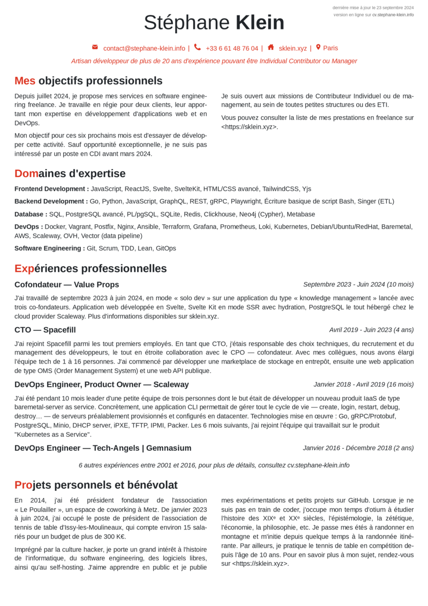

Après avoir tondu un Yak [ici](https://github.com/stephane-klein/typst-sklein-resume-poc), avec [Typst](https://typst.app) pour générer mon CV au format PDF.

Après avoir rédigé un CV trop long [ici](https://sklein.xyz/fr/cv/).

J'ai décidé de produire un CV qui tient sur une feuille A4, implémenté simplement en HTML + CSS.

Je génère la version PDF avec la fonctionnalité d'impression de Chrome.

Cela donne ceci :

